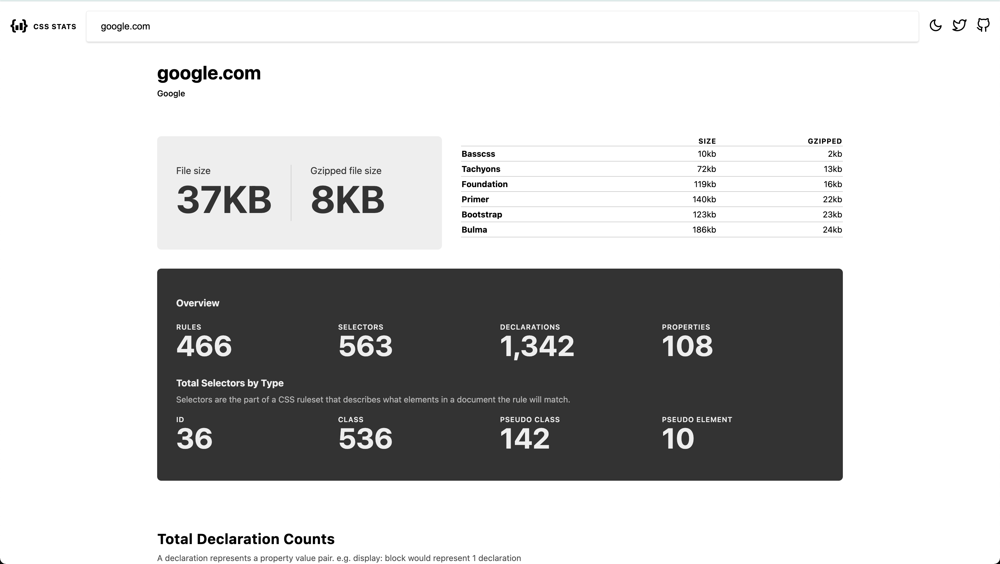

## URL as program

```
https://ncase.me/loopy/v1.1/?data=%5B%5B%5B3,514,229,1,%22discussion%22,4%5D,%5B4,1033,248,0,%22meetings%22,2%5D,%5B5,895,485,0,%22call%2520for%2520table%22,3%5D,%5B6,508,572,0,%22Major%2520Objection%22,0%5D,%5B7,266,433,0,%22approved%22,3%5D%5D,%5B%5B5,4,-27,1,0%5D,%5B3,6,10,1,0%5D,%5B3,5,78,1,0%5D,%5B3,7,-12,1,0%5D,%5B4,3,-107,1,0%5D%5D,%5B%5D,7%5D
```

## TLD chain as DNS for the Meta org | jobs/ID as a temp document store

```
https://us.meta.talentnet.community/jobs/538bee9a-4e13-49ba-b1f8-c28506b0188a
```

## google is a repl with an unspecified syntax

e.g. "english to german"

gives us the link below

`q` = "english to german"
`sxsrf` = timestamp

rest of the link is a light declarative program syntax

```
https://www.google.com/search?q=english+to+german&sxsrf=APq-WBtjg3eDhOAz7FI6-_hOLWmGIDAKMQ%3A1649357569905&ei=ATNPYqv7NsibptQP6I2R2Ao&ved=0ahUKEwjr_77gz4L3AhXIjYkEHehGBKsQ4dUDCA4&uact=5&oq=english+to+german&gs_lcp=Cgdnd3Mtd2l6EAMyBwgjELADECcyBwgAEEcQsAMyBwgAEEcQsAMyBwgAEEcQsAMyBwgAEEcQsAMyBwgAEEcQsAMyBwgAEEcQsAMyBwgAEEcQsAMyBwgAEEcQsAMyBwgAELADEENKBAhBGABKBAhGGABQAFgAYJoCaAFwAXgAgAEAiAEAkgEAmAEAyAEKwAEB&sclient=gws-wiz
```
[[more](https://twitter.com/cwervo/status/1512142085801005067)]

## shields

```

```

`=>` 

a `url` "pipes" to an image. `url` as root program in a linux command chain!


## a REPL over CSS
https://cssstats.com/stats/?url=google.com
