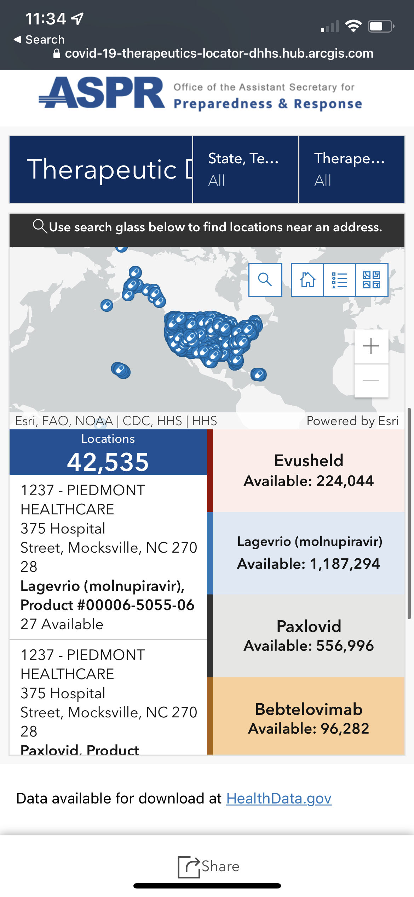

## Surviving Covid

(TODO, note to self: enumerate everything on the tray)

- Vitamin C & D (w/ K2 for maximum bioavailability of D), 1 gram daily (recommended from Infection Control from my Grandmother's hospital)
- [Makuna Honey](https://twitter.com/cwervo/status/1511397723072782339?s=21&t=jthvJ_xv05xCyoPD0tsGsw) in order to calm my throat. It turns out MGO (the active compound in Manuka honey, honey collected from [_Leptospermum_, the manuka tree](https://en.wikipedia.org/wiki/Leptospermum)) is both antibacterial (a general property of honey's viscocity, I believe) & anti-inflamatory (this is a property of MGO)
- Cycled 3 Aleve, 220 mg (an NSAID) every 4 hours, with 1000g Tylenol (acetaminophin, pain-relief & general fever reducer). While it's [possible to mix NSAIDs like ibuprofen & Tylenol dangerously](https://khealth.com/learn/medication/taking-ibuprofen-and-acetaminophen-together/) apparently Tylenol & Aleve are _generally_ fine to take together.

<!--  -->

### Paxlovid's packaging is lovely & clearly explained for at-home use

---

[It seems the pharmacy w/ the highest supply is Alto Pharmacy as of April 2022 in NYC](https://twitter.com/cwervo/status/1511426876715196417?s=21&t=jthvJ_xv05xCyoPD0tsGsw)

> 
- ([source](https://www1.nyc.gov/site/doh/covid/covid-19-providers-treatments.page#refer))

----

# random note

[I've been researching pharmacokinetics](https://twitter.com/cwervo/status/1511568840244748292?s=21&t=jthvJ_xv05xCyoPD0tsGsw) & this diagram is super useful:

[https://twitter.com/cwervo/status/1511568841326931970?s=21&t=jthvJ_xv05xCyoPD0tsGsw]